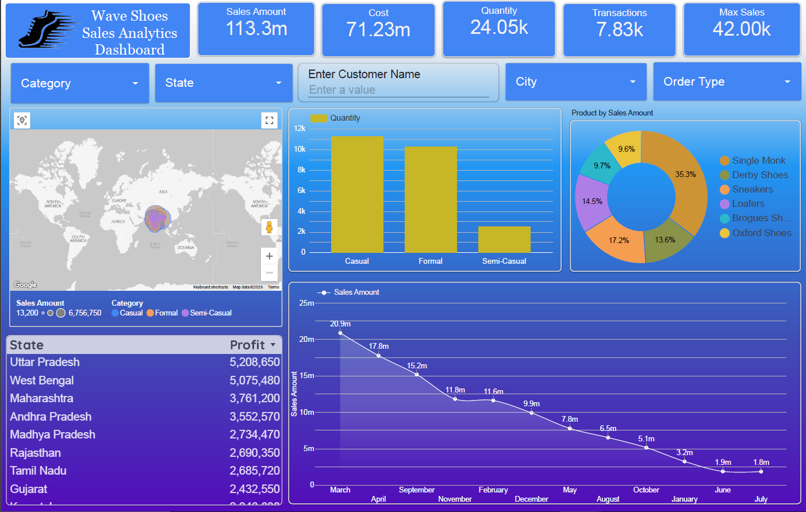

#  Wave Shoes Sales Analytics Dashboard

An interactive **Sales Analytics Dashboard** built using **Google Looker Studio** to transform raw sales data into meaningful business insights. The dashboard provides an intuitive interface for monitoring key performance indicators (KPIs), analyzing sales trends, evaluating regional performance, and supporting data-driven business decisions.

---


# 📖 Project Overview

Businesses generate thousands of sales records every month, but raw data alone cannot drive effective decision-making. Managers need a centralized reporting system that provides real-time insights into sales performance, customer behavior, product demand, and regional profitability.

The **Wave Shoes Sales Analytics Dashboard** was developed using **Google Looker Studio** to provide an interactive and visually appealing reporting solution. It consolidates sales data into one dashboard where users can explore KPIs, analyze trends, compare products, and identify business opportunities through interactive filters and dynamic visualizations.

---

# 💼 Business Problem

**Wave Shoes**, a footwear retail company, was experiencing increasing sales across multiple regions. However, management lacked a centralized reporting system to monitor overall business performance.

Sales information was spread across multiple datasets, making it difficult to answer important business questions such as:

- Which products generate the highest revenue?
- Which states and cities contribute the most sales?
- Which product categories perform best?
- How do sales change throughout the year?
- Which regions generate the highest profit?
- What are the overall sales, costs, and transaction metrics?

Without an interactive dashboard, business decisions relied heavily on manual reports, resulting in delayed insights and reduced operational efficiency.

---

# ✅ Solution

To solve this problem, I designed an interactive **Business Intelligence Dashboard** using **Google Looker Studio**.

The dashboard integrates sales data into a centralized reporting interface featuring:

- Executive KPI cards
- Geographic sales analysis
- Product performance visualization
- Monthly sales trends
- Profit analysis by state
- Interactive filters for dynamic exploration

This enables stakeholders to quickly identify trends, monitor business performance, and make informed, data-driven decisions.

---

# 🎯 Project Objectives

- Monitor overall sales performance
- Track important business KPIs
- Analyze sales across different regions
- Identify top-performing products
- Evaluate monthly sales trends
- Compare product categories
- Support strategic business decision-making

---

# 📊 Key Performance Indicators (KPIs)

The dashboard provides a quick overview of business performance using KPI scorecards.

- 💰 Total Sales Amount
- 💵 Total Cost
- 📦 Total Quantity Sold
- 🛒 Total Transactions
- 📈 Maximum Sales
- 💹 State-wise Profit

---

# ✨ Dashboard Features

### 📌 Interactive Filters

Users can dynamically filter the dashboard by:

- Category
- State
- Customer Name
- City
- Order Type

These filters allow users to drill down into specific business segments without modifying the underlying dataset.

---

### 🌍 Geographic Sales Analysis

An interactive Google Map visualizes regional sales performance, allowing users to identify:

- High-performing states
- Sales concentration
- Regional business opportunities

---

### 📊 Quantity Analysis

A bar chart compares quantities sold across different product categories including:

- Casual
- Formal
- Semi-Casual

---

### 🍩 Product Sales Distribution

A donut chart displays each product's contribution to total sales, helping identify:

- Best-selling products
- Revenue contribution
- Product demand

---

### 📈 Monthly Sales Trend

A line chart tracks monthly sales performance to reveal:

- Seasonal demand
- Growth patterns
- Peak sales periods
- Declining trends

---

### 📋 State-wise Profit Analysis

A tabular visualization highlights the most profitable states, helping management evaluate regional performance.

---

# 🛠️ Tech Stack

| Technology | Purpose |
|------------|----------|
| Google Looker Studio | Dashboard Development |
| Google Sheets / CSV | Data Source |
| Google Maps | Geographic Visualization |
| Data Visualization | Business Intelligence |

---

# 📈 Business Insights

The dashboard enables users to answer key business questions such as:

- Which products contribute the highest revenue?
- Which states generate maximum profit?
- Which category sells the highest quantity?
- How do sales fluctuate month over month?
- Which regions require more marketing efforts?
- How many transactions are completed?

---

# 📂 Dashboard Components

- Executive KPI Cards
- Interactive Filters
- Google Maps
- Bar Chart
- Donut Chart
- Line Chart
- Profit Table

---
## 📸 Dashboard Demo

<p align="center">
  
</p>

---

# 🚀 Skills Demonstrated

This project showcases the following Business Intelligence and Data Analytics skills:

- Business Intelligence
- Dashboard Design
- Data Visualization
- KPI Reporting
- Sales Analytics
- Business Analysis
- Interactive Reporting
- Data Storytelling
- Geographic Analysis
- Decision Support Systems

---

# 💡 Business Use Cases

This dashboard can be used by:

- Retail Companies
- Footwear Brands
- Sales Managers
- Business Analysts
- Marketing Teams
- Regional Managers
- Executive Leadership

---

# 📚 Learning Outcomes

Through this project, I gained practical experience in:

- Building professional dashboards in Google Looker Studio
- Creating interactive reports
- Designing business KPIs
- Developing executive dashboards
- Visual storytelling with data
- Business performance analysis

---

# 🔮 Future Enhancements

- Customer Segmentation Dashboard
- Sales Forecasting
- Profit Margin Analysis
- Inventory Monitoring
- Year-over-Year Comparison
- Customer Retention Analysis
- Automated Data Refresh
- Mobile Dashboard Optimization

---

# 📁 Repository Structure

```
Wave-Shoes-Sales-Analytics-Dashboard/
│
├── README.md
├── dashboard.png
├── Wave_Shoes_Dashboard.pdf
├── data/
│   └── sales_data.csv
├── assets/
│   └── logo.png
└── LICENSE
```

---

# 👩‍💻 Author

**Gauri Borse**

**Data Analyst | Business Analyst | AI Explorer**

### Skills

- Python
- SQL
- Google Looker Studio
- Power BI
- Excel
- Data Visualization
- Business Intelligence

---

## ⭐ Support

If you found this project useful or inspiring, consider giving it a **⭐ Star** on GitHub!
